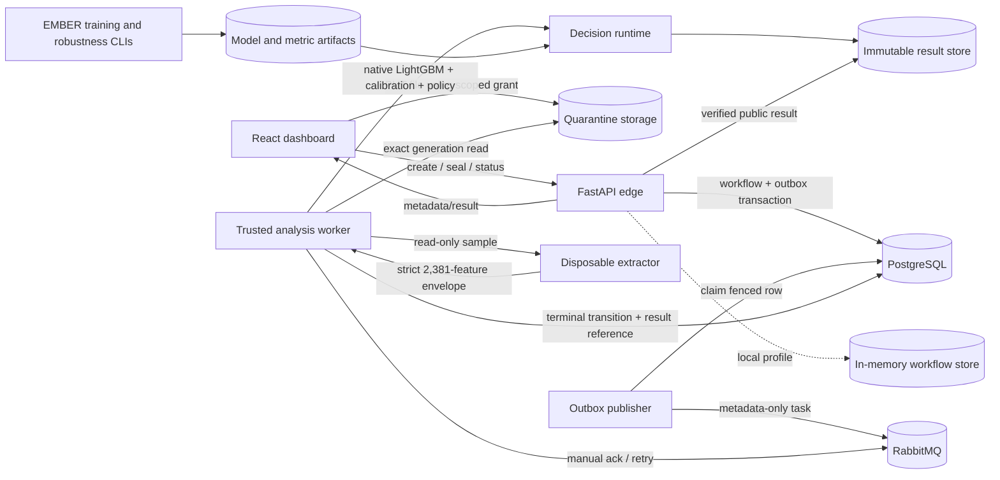
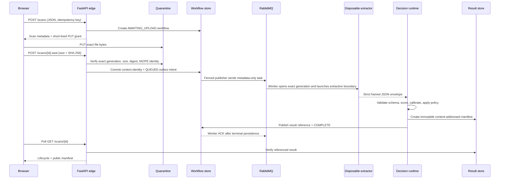
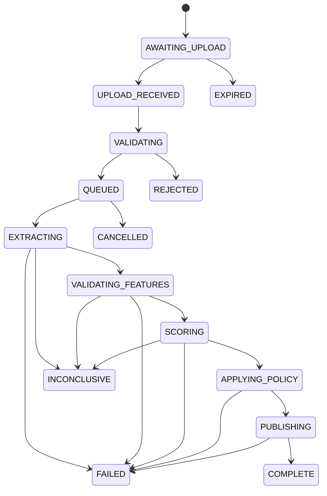
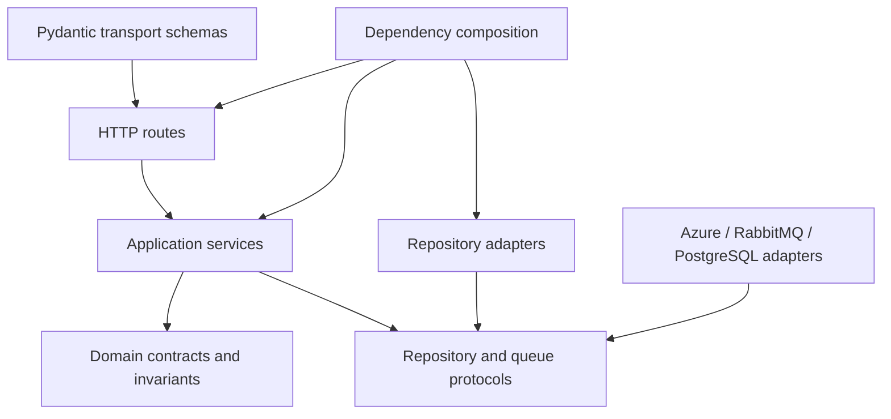

# Architecture

## 1. Architectural goals

The runtime treats uploaded executables as hostile content. Its design goals are:

- never execute a submitted PE;
- keep hostile bytes away from the edge API, queue payload, and trusted scoring process after
  quarantine;
- bind every job to an exact object generation, size, and SHA-256;
- parse content only inside a disposable, resource-bounded boundary;
- validate all extractor output before trusted scoring;
- separate model output from independently observed evidence;
- make workflow transitions and result publication monotonic and auditable;
- preserve immutable release identities in every public result.

## 2. Component topology

The local auto-processing profile replaces PostgreSQL, RabbitMQ, and the separate publisher
with in-memory state and a direct call to the same analysis handler. It is disabled until an
extractor is explicitly configured; the same-host child-process runner requires a development-only
unsafe acknowledgement.

## 3. Trust zones

| Zone | Trust assumption | Permitted data |
|---|---|---|
| Browser | Untrusted client | User-selected file before upload; public scan metadata and result afterward |
| Edge API | Internet-facing and validation-focused | Filename, declared size/type, hashes, object identity, workflow metadata; never hostile file bytes |
| Quarantine | Hostile-content storage | Exact uploaded bytes under an opaque, server-generated object identity |
| PostgreSQL | Trusted control plane | Workflow state, immutable content identity, events, leases, outbox rows; no file bytes or feature vectors |
| RabbitMQ | Trusted delivery plane with a hostile-input contract | Nine allowlisted scalar metadata fields only |
| Extractor | Disposable and treated as compromised after parsing | Read-only sample bytes; emits a bounded, untrusted JSON envelope |
| Decision worker | Trusted compute | Validated feature vector, bounded evidence, pinned model and policy identities |
| Result store | Public-result persistence | Canonical manifest only; never raw file bytes or the 2,381-value feature vector |

There is no legacy upload exception. `X-Aegis-Scan: static-pe-v1` returns `410 Gone`; all new
scans use the quarantine-backed `hostile-content-v1` protocol.

## 4. End-to-end asynchronous flow

## 5. Workflow state model

The domain model and PostgreSQL triggers constrain legal transitions. Terminal workflows are
immutable. Leases, optimistic versions, and fencing tokens prevent a stale publisher or worker
from committing after ownership has changed.

## 6. Delivery and consistency model

### 6.1 Idempotent creation

The asynchronous create request requires exactly one bounded `Idempotency-Key`. A tenant and key
identify one creation attempt, allowing safe client retries without generating duplicate jobs.

### 6.2 Transactional outbox

The transition to `QUEUED` and its outbox record are persisted in one PostgreSQL transaction.
The publisher claims rows with `FOR UPDATE SKIP LOCKED`, records a fencing token, publishes with
RabbitMQ confirms, and marks the matching claim delivered. Delivery is at least once, so the
worker and workflow transitions are idempotent by identity and nonce.

### 6.3 Queue contract

The task schema allowlists only:

- `schema_version`
- `scan_id`
- `tenant_id`
- `object_key`
- `object_generation`
- `sample_sha256`
- `analysis_release_id`
- `attempt`
- `job_nonce`

Filename, URLs, upload capabilities, file bytes, extracted strings, evidence, and feature vectors
are invalid queue fields.

### 6.4 Exact object identity

The seal operation commits one object generation and expected digest. The worker opens that exact
generation and recomputes size and SHA-256 before parsing. It never resolves a mutable "latest"
object.

### 6.5 Immutable result identity

The result manifest is serialized as canonical JSON and addressed by its SHA-256. Local storage
uses create-only filesystem semantics; the Azure-compatible repository uses conditional blob
creation. A separate immutable claim binds `(scan_id, analysis_release_id)` to one content hash.

## 7. Backend dependency direction

Routes do not access dataset, database, queue, or object-storage implementations directly.
Services orchestrate domain operations through interfaces; repositories contain I/O-specific
behavior. `runtime_composition.py` is the process-level assembly point.

## 8. Runtime profiles and their guarantees

| Property | Local auto-processing | Distributed profile |
|---|---|---|
| Workflow persistence | In memory | PostgreSQL |
| Queue | Direct handler call through local outbox adapter | RabbitMQ durable queue and dead-letter queue |
| Quarantine | Local write-once files | Local or Azure private versioned blobs |
| Extraction | Explicitly configured only | Digest-pinned container with an enforced seccomp profile |
| Result storage | Local immutable files | Local repository currently composed; Azure result repository exists but is not selected by runtime settings |
| Restart recovery | Limited | Workflow/outbox durable; edge presentation cache and result composition still need production review |
| Intended use | Development and demonstration | Integration and hardening basis |

## 9. Important architecture gaps

- No HTTP authentication, role authorization, or real tenant resolution exists.
- The edge service keeps scan presentation/upload metadata in memory; distributed workflow state
  is durable, but all response composition is not yet fully restart-safe.
- `AzureBlobResultRepository` exists but `runtime_composition.py` currently composes
  `LocalResultRepository` unconditionally.
- The container command validates and attaches the reviewed seccomp profile in addition to its
  network, filesystem, user, capability, and resource controls. It still shares the host kernel.
- No automated retention, quarantine deletion, cancellation endpoint, readiness endpoint,
  centralized metrics, tracing, or alerting is included.
- A container reduces parser exposure but is not the same trust boundary as a microVM or a
  separate hardened host.

These gaps are converted into prioritized work in
[Known limitations and roadmap](14-known-limitations-roadmap.md).
