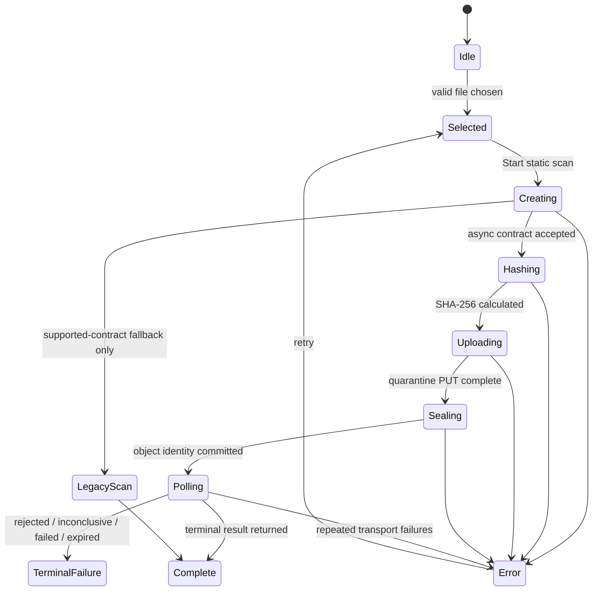

# Frontend design

## 1. Purpose and stack

The frontend is a single-page operational and research dashboard under `frontend/`. It uses:

- React 19 and TypeScript;
- Vinext on Vite 8 for development and production builds;
- Tailwind CSS for styling;
- shadcn/Base UI primitives;
- Lucide icons;
- Recharts for experiment visualizations.

The only runtime environment value used by the application is:

```text
NEXT_PUBLIC_API_URL=http://127.0.0.1:8000
```

If absent, the same local URL is used by default.

## 2. Application composition

`frontend/app/page.tsx` owns the dashboard shell, navigation, API status loading, and research
views. The available views are:

| View | Purpose |
|---|---|
| Scan | Upload a PE, observe lifecycle, inspect result, and review scan history |
| Overview | Summarize dataset readiness, baseline quality, robustness, and hardening |
| Datasets | Display EMBER2018 availability and invoke verification/smoke-test actions |
| Experiments | Display the latest completed baseline metrics and confusion matrix |
| Robustness | Display perturbation scenarios and degradation metrics |
| Runs | Compare baseline and hardened experiment outputs |

Navigation supports expanded and collapsed layouts. The collapsed menu uses visible icons and
tooltips rather than hiding the available destinations.

Reusable scanner behavior lives in `frontend/components/scanner-workspace.tsx`; presentation is
split into small components under `frontend/components/scanner/`.

## 3. Scanner component map

| Component | Responsibility |
|---|---|
| `scanner-workspace.tsx` | State machine, file validation, hashing, API calls, polling, fallback, and composition |
| `scan-upload-card.tsx` | File picker/drop surface and scan action |
| `scan-lifecycle.tsx` | Current workflow phase and progress |
| `scan-result.tsx` | Verdict, calibrated risk, evidence, release identities, and limitations |
| `scan-history-card.tsx` | Recent async and legacy scan entries |
| `safety-boundary-card.tsx` | Explains quarantine, non-execution, extraction, and immutable results |
| `verdict-badge.tsx` | Consistent decision styling |
| `formatters.ts` | Bounded formatting helpers |
| `types.ts` | Client-side API contracts |

The shared UI primitives in `frontend/components/ui/` are design-system building blocks; most
are generated shadcn components and are not scanner-specific business logic.

## 4. Browser scan state machine



The browser computes SHA-256 locally through the Web Crypto API. The seal request sends the
digest and exact byte size, but the server independently verifies both values against the stored
object.

## 5. Async API behavior

The preferred client in `frontend/lib/scanner-api.ts` uses the hostile-content protocol:

1. `POST /api/v1/scans` with JSON, `X-Aegis-Scan: hostile-content-v1`, and a unique
   `Idempotency-Key`.
2. `PUT` the file to the returned upload URL with the returned scoped headers.
3. Read `ETag` and supported cloud generation headers (`x-ms-version-id` or
   `x-goog-generation`) when present. Local mode can seal without returning its generation to
   this client because the edge retains the issued object identity.
4. `POST /api/v1/scans/{scan_id}:seal` with SHA-256, size, and object identity.
5. Poll `GET /api/v1/scans/{scan_id}` approximately every 1.25 seconds until terminal.

Polling tolerates up to five consecutive transient retrieval errors. A normal terminal state or
a non-transient API error stops polling.

## 6. Legacy fallback

`frontend/lib/legacy-scanner-api.ts` implements the local synchronous multipart protocol. The UI
falls back only when async creation reports a contract-not-supported status (`404`, `405`, `415`,
`422`, or `501`). It does not silently fall back after an upload, seal, or processing failure,
because doing so could scan a different request under weaker isolation without clear intent.

The compatibility request sends `X-Aegis-Scan: static-pe-v1` and one multipart field named
`file`.

## 7. File selection and user-visible safety

The picker accepts `.exe`, `.dll`, `.sys`, `.scr`, `.cpl`, and `.ocx`. It rejects an empty file
or a file larger than the frontend's 25 MiB limit before network transfer. The backend performs
authoritative size and PE validation; client-side checks are usability controls only.

The UI communicates four important facts:

- analysis is static and the file is not intentionally launched;
- the preferred flow stores it in quarantine before parsing;
- a high or low score is not certainty;
- static-analysis limitations are part of the result, not hidden help text.

## 8. Research dashboard loading

On page load, `page.tsx` requests four endpoints in parallel:

- `/api/v1/datasets/ember2018/status`
- `/api/v1/experiments/baseline`
- `/api/v1/experiments/robustness`
- `/api/v1/experiments/comparison`

These responses populate all non-scan views. The current connection indicator considers this
group as a unit; failure of an experiment/status endpoint can make the dashboard appear offline
even if `/health` and scanning still work. Splitting liveness, scanner readiness, dataset
readiness, and artifact availability is a future UX improvement.

## 9. Styling and accessibility

The visual system uses a dark navy surface with cyan/teal operational accents, violet model
accents, and semantic green/amber/red verdict colors. Layouts are responsive and the navigation
supports a collapsed sidebar.

UI primitives provide keyboard and focus behavior, but the repository does not currently have
automated accessibility tests. Before production, validate keyboard-only operation, visible
focus, contrast, reduced motion, screen-reader labels, live-region announcements, and table/chart
alternatives.

## 10. Build and validation

From `frontend/`:

```powershell
npm ci
npm run build
npm run lint
```

`npm run build` performs the production TypeScript/Vite build. `npm run lint` runs Oxlint across
the entire frontend. Generated UI primitives may expose upstream lint findings; scanner-specific
files should still remain clean and any full-suite suppression should be explicit.

## 11. Current frontend gaps

- No component, integration, browser end-to-end, or accessibility test suite is committed.
- Authentication and role-aware navigation are absent because the API has no identity layer.
- History has no pagination controls, filtering, search, export, cancellation, or deletion.
- The browser has no resumable upload or explicit upload retry protocol.
- The connection indicator conflates API reachability with dataset/experiment readiness.
- There is no server-sent event or WebSocket channel; status uses polling.
- Build output targets Cloudflare-compatible Vinext tooling, but backend deployment, CORS, and
  upload-storage CORS must be configured separately.

## 12. Adding a frontend feature

1. Add transport types and API behavior under `frontend/lib/` or the scanner type module.
2. Keep workflow state in the owning workspace component; keep display-only components pure.
3. Render explicit loading, empty, error, unavailable, and terminal states.
4. Do not infer security guarantees from file extension or client-side validation.
5. Keep raw file bytes out of logs, analytics, route state, and local persistence.
6. Add component tests and one browser-level happy/failure path when the test framework is added.
7. Run the production build and scanner-specific lint before review.
