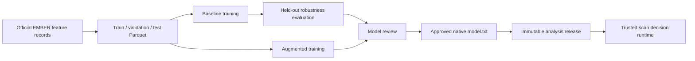

# ML and data pipeline

## 1. Scope and safety model

The research pipeline trains and evaluates binary static classifiers using extracted numeric
features. The official EMBER2018 archive contains feature records, not executable malware. The
robustness suite perturbs copied numeric arrays; it does not mutate, synthesize, execute, or
distribute binaries.

The pipeline does not use Hugging Face. Its authoritative dataset source is Elastic's EMBER
hosting endpoint.

## 2. EMBER2018 acquisition

| Property | Value |
|---|---|
| Source | `https://ember.elastic.co/ember_dataset_2018_2.tar.bz2` |
| Archive | `ember_dataset_2018_2.tar.bz2` |
| Expected SHA-256 | `b6052eb8d350a49a8d5a5396fbe7d16cf42848b86ff969b77464434cf2997812` |
| Feature version | 2 |
| Vector size | 2,381 |
| Default raw root | `data/raw` |

Download and verify:

```powershell
malware-data download --raw-dir data/raw
malware-data verify --raw-dir data/raw
malware-data smoke-test --raw-dir data/raw
```

Acquisition behavior:

1. Downloads through a `.part` file and resumes with an HTTP range request where possible.
2. Calculates SHA-256 locally and rejects any mismatch.
3. Extracts with Python's safe tar data filter.
4. Checks for six training JSONL shards, a test JSONL file, and the included benchmark model.
5. Writes provenance to `data/raw/ember2018/manifest.json`.

The API's verify and smoke-test endpoints are read/validation operations; they do not download
or repair data.

## 3. Representative dataset preparation

Create deterministic class-balanced Parquet partitions:

```powershell
malware-data prepare-sample `
  --raw-dir data/raw `
  --output-dir data/processed/representative
```

Defaults:

| Partition | Rows |
|---|---:|
| Train | 20,000 |
| Validation | 5,000 |
| Test | 5,000 |

The preparation path streams raw records, uses record SHA-256 values for deterministic
selection across all source shards, vectorizes to the official feature layout, and writes Arrow
and Parquet batches with bounded memory. Selection is balanced across labels and repeatable for
the same inputs and parameters.

Custom sizes are available through `--train-rows`, `--validation-rows`, and `--test-rows`.

## 4. Generic feature-table contract

The generic loader supports CSV and Parquet. Every table must contain:

- a binary label column, `label` by default;
- both labels `0` (benign) and `1` (malware);
- one or more numeric feature columns;
- no missing, non-numeric, infinite, or `NaN` values.

`split_feature_table` creates reproducible stratified train, validation, and test partitions
from one prepared table. Persist those partitions before training so an experiment does not
silently change its test population.

## 5. Experiment configuration

### `configs/baseline.yaml`

- experiment: `baseline_lightgbm`;
- expects `data/processed/{train,validation,test}.parquet`;
- seed 42;
- 300 estimators, learning rate 0.05, 31 leaves;
- fixed decision threshold 0.5.

### `configs/ember2018-sample.yaml`

- experiment: `baseline_lightgbm_representative`;
- uses representative partitions;
- same core LightGBM size;
- calibrates the decision threshold on validation data.

### `configs/robust-lightgbm.yaml`

- experiment: `robust_lightgbm`;
- uses representative partitions;
- 400 estimators;
- validation threshold calibration enabled;
- used by the hardening workflow and runtime's default model path.

Configuration validation rejects missing paths, malformed sections, invalid labels, invalid
thresholds, and unsafe model parameters before training.

## 6. Baseline training

```powershell
malware-train --config configs/ember2018-sample.yaml --artifacts-dir artifacts
```

The trainer:

1. Loads explicit train, validation, and test partitions.
2. Fits `lightgbm.LGBMClassifier` on training data.
3. Uses validation early stopping with 30 rounds.
4. Optionally chooses the F1-maximizing threshold from validation predictions.
5. Evaluates the held-out test table only after fitting/calibration.
6. Writes the native LightGBM text model and JSON metrics.

Reported clean metrics include:

- accuracy;
- precision;
- recall;
- F1;
- ROC-AUC;
- average precision;
- true/false positive and true/false negative counts.

Typical output:

```text
artifacts/<experiment-name>/
├── model.txt
└── metrics.json
```

Older completed run directories remain available; experiment API repositories select the newest
recognized result.

## 7. Robustness evaluation

```powershell
malware-robustness `
  --config configs/ember2018-sample.yaml `
  --artifacts-dir artifacts
```

The suite copies held-out malware feature rows and applies bounded transformations at intensities
`0.10`, `0.25`, and `0.50`:

| Scenario | Safe feature-space interpretation |
|---|---|
| `histogram_smoothing` | Moves byte/entropy histogram mass toward a smoother profile |
| `string_attenuation` | Reduces string-statistic signals |
| `hashed_feature_dropout` | Drops bounded hashed import/export components |
| `combined` | Applies the configured transformations together |

It records detection rate, evasion rate, probability movement, and worst-case scenario data in
`robustness.json`. These are model-sensitivity simulations, not claims that a concrete binary
transformation is valid or undetectable.

## 8. Adversarial hardening

```powershell
malware-harden `
  --config configs/robust-lightgbm.yaml `
  --artifacts-dir artifacts
```

Hardening creates one perturbed copy per training row and combines it with clean training rows.
Both classes are included. Validation and test tables remain clean and unchanged, preventing
test leakage.

The workflow compares baseline and hardened models on:

- clean accuracy and ROC-AUC;
- worst perturbed malware detection rate;
- worst evasion rate;
- deltas between baseline and hardened performance.

The comparison is written to `comparison.json`, while the deployable native model is written to:

```text
artifacts/robust_lightgbm/model.txt
```

That exact path is the scanner runtime default.

## 9. Relationship between research and runtime



The repository currently automates experimentation, but approval, signing, promotion, rollback,
and release registry operations are manual. Do not overwrite a model behind an unchanged
analysis release identity in a distributed deployment.

## 10. Reproducibility checklist

- Keep the YAML configuration in Git.
- Record the repository revision and Python dependency lock.
- Verify the source archive SHA-256 and retain its generated manifest.
- Record exact partition paths, row counts, labels, and feature schema.
- Keep random seed 42 unless a deliberate experiment changes it.
- Calibrate only on validation data.
- Evaluate test data only after model and threshold decisions are complete.
- Preserve `metrics.json`, `robustness.json`, `comparison.json`, and native model hash.
- Assign new release identities whenever model, schema, extractor, calibrator, or policy behavior
  changes.

## 11. ML limitations

- EMBER2018 does not represent current malware prevalence or every PE subtype.
- A representative 30,000-row sample is fast and reproducible but not equivalent to training on
  the full dataset.
- Feature-space perturbations approximate sensitivity and do not prove binary-level evasion.
- Accuracy can hide class-specific errors; precision, recall, PR-AUC, and confusion counts must
  be reviewed together.
- Threshold calibration can overfit a small or unrepresentative validation set.
- Model explainability is not currently composed into the trusted runtime.
- Drift monitoring and automated retraining are not implemented.
