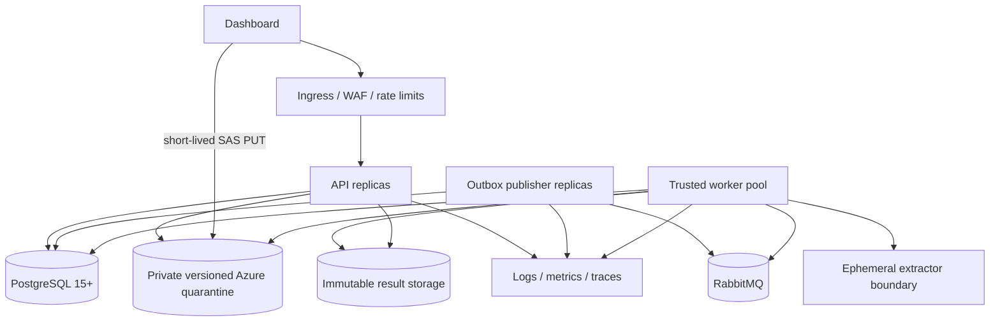

# Deployment and operations

## 1. Deployment status

The repository contains distributed runtime adapters and database migrations, but not a complete
production deployment. There is no Docker Compose, Kubernetes chart, infrastructure-as-code
stack, managed identity assignment, secret-store integration, monitoring dashboard, or SLO
definition.

This document describes the intended topology and the controls that an operator must supply.

## 2. Recommended topology



Use separate service identities and network policies for API, publisher, worker, database, queue,
quarantine, and result storage. The extractor must receive no cloud credential and no network.

## 3. Install runtime dependencies

```powershell
python -m pip install -e ".[runtime,azure]"
```

Use the lock file or an approved dependency-build process for a real release. Build backend and
extractor images once, scan/sign them, push them to an immutable registry, and deploy by digest.

## 4. PostgreSQL

### Requirements

- PostgreSQL 15 or newer;
- TLS for remote connections;
- a dedicated database and least-privilege runtime role;
- schema-migration credentials separate from runtime credentials;
- backups and point-in-time recovery aligned with audit requirements.

Apply migrations in order:

```powershell
psql $env:MALWARE_DATABASE_URL `
  -v ON_ERROR_STOP=1 `
  -f db/migrations/001_scan_workflows.sql
psql $env:MALWARE_DATABASE_URL `
  -v ON_ERROR_STOP=1 `
  -f db/migrations/002_workflow_delivery.sql
```

Migration 001 creates the workflow-state enum, legal transitions, aggregate table, append-only
events, transactional outbox, constraints, and triggers. Migration 002 adds sealed-content
immutability, outbox fencing/failure fields, metadata-only payload constraints, and retrieval
indexes.

Back up both workflow state and events. A result reference without its immutable object is not a
complete record, so result storage backup/integrity validation must be coordinated.

## 5. RabbitMQ

With queue name `malware.scan`, the adapter declares:

| Resource | Name |
|---|---|
| Direct exchange | `malware.scan.exchange` |
| Work queue/routing key | `malware.scan` |
| Dead-letter exchange | `malware.scan.dead-letter.exchange` |
| Dead-letter queue | `malware.scan.dead-letter` |
| Dead-letter routing key | `malware.scan.rejected` |

Resources are durable. Messages are persistent, publisher-confirmed, and consumed with manual
acknowledgements and prefetch 1. The default handler retry policy allows attempts 0 through 3;
malformed, non-retryable, or exhausted messages are dead-lettered.

Operational requirements:

- use `amqps://` and a dedicated vhost/user;
- restrict permissions to the named exchanges and queues;
- alert on dead-letter growth, unacked age, queue depth, publish confirm failures, and connection
  churn;
- never inspect or enrich messages with raw sample data;
- size-limit and retain broker logs without message bodies.

## 6. Azure Blob quarantine

The Azure account and container must be configured with:

- HTTPS only;
- public access disabled;
- blob versioning enabled;
- soft delete/retention according to policy;
- customer-managed keys if required by governance;
- private endpoints and network restrictions where applicable;
- CORS permitting only the dashboard origin, `PUT`, and the required/exposed headers;
- diagnostic logs that do not expose SAS query strings.

The API identity needs enough permission to obtain a user-delegation key and validate blob
properties/versions. The worker identity needs read access to the exact sealed version. Neither
identity should have broad container administration unless operationally required.

The application rejects public containers and mutable/latest object resolution. Validate these
assumptions against the deployed account before accepting traffic.

## 7. Extractor image

Build the provided minimal image:

```powershell
docker build `
  --file docker/extractor/Dockerfile `
  --tag aegis-extractor:local `
  .
```

The Dockerfile uses a digest-pinned Python 3.12.11 slim base, exact extractor dependency versions,
UID/GID 65534, and no model, cloud SDK, or credential helper. A local image tag is insufficient
for distributed release; push it to an approved registry, retrieve its registry digest, and set:

```text
MALWARE_EXTRACTOR_IMAGE_REFERENCE=<registry>/<image>@sha256:<digest>
MALWARE_EXTRACTOR_IMAGE_DIGEST=sha256:<same-digest>
```

The runner enforces no network, read-only root, capability drop, no-new-privileges, non-root user,
PID 64, 384 MiB memory and swap, one CPU, 64 open files, no core dumps, and a 16 MiB no-exec
temporary filesystem by default.

`docker/extractor/seccomp-profile.json` is a deny-by-default profile validated by the application
and attached to every container launch. The runner fails closed if the profile is missing, is a
symbolic link, is malformed, lacks an allowlist, or changes after startup. A label in the Dockerfile
is supplemental documentation, not the enforcement mechanism. A hardened microVM or separate host
remains the stronger boundary for adversarial parser input.

## 8. Process configuration

Configure all processes with the same release identities, policy, database, queue, and storage
coordinates. At minimum:

```powershell
$env:MALWARE_WORKFLOW_BACKEND = "postgres"
$env:MALWARE_DATABASE_URL = "postgresql://..."
$env:MALWARE_RABBITMQ_URL = "amqps://..."
$env:MALWARE_RABBITMQ_QUEUE = "malware.scan"
$env:MALWARE_QUARANTINE_BACKEND = "azure"
$env:MALWARE_AZURE_ACCOUNT_URL = "https://account.blob.core.windows.net"
$env:MALWARE_AZURE_QUARANTINE_CONTAINER = "quarantine"
$env:MALWARE_EXTRACTOR_RUNNER = "container"
$env:MALWARE_EXTRACTOR_IMAGE_REFERENCE = "registry.example/aegis-extractor@sha256:..."
$env:MALWARE_EXTRACTOR_IMAGE_DIGEST = "sha256:..."
$env:MALWARE_ANALYSIS_RELEASE_ID = "sha256:..."
$env:MALWARE_UPLOAD_GRANT_SECRET = "<secret-manager-value>"
$env:MALWARE_CORS_ORIGINS = "https://dashboard.example.com"
```

Start separate process roles:

```powershell
malware-api
malware-outbox
malware-worker
```

Do not enable `MALWARE_RUNTIME_AUTO_PROCESS` in this topology.

## 9. Startup order and release procedure

1. Verify backups and migration compatibility.
2. Apply database migrations once using the migration identity.
3. Publish and verify digest-pinned worker/extractor/model artifacts.
4. Deploy RabbitMQ and validate topology/TLS/permissions.
5. Validate private, versioned quarantine storage and CORS.
6. Deploy workers with no public ingress; verify exact object read and extractor isolation.
7. Deploy outbox publishers and check publisher confirms.
8. Deploy API replicas behind authenticated ingress and rate limiting.
9. Deploy the frontend with the correct public API URL.
10. Run a controlled canary scan and verify workflow event, queue task, result digest, and UI.
11. Monitor failures and dead letters before scaling traffic.

Never reuse an analysis release identity for different model, extractor, schema, calibrator, or
trusted worker content.

## 10. Health, readiness, and observability

`GET /health` proves only that the API process can answer. It does not check:

- PostgreSQL connectivity/migrations;
- RabbitMQ publisher/consumer connectivity;
- model presence and hash;
- quarantine access/versioning/privacy;
- result storage access;
- extractor image availability;
- worker backlog or dead-letter state.

Before production, add separate liveness and dependency-aware readiness probes. Recommended
metrics include:

- creates, upload/seal failures, and rejection reasons;
- workflow age by state and terminal outcome;
- outbox pending age, claim conflicts, retries, and failures;
- queue depth, oldest message, unacked count, retry attempt, and dead letters;
- extraction duration, timeout, output-bound failure, and parser failure code;
- scoring/publishing latency and model/release identity;
- result integrity failures;
- quarantine bytes/object age;
- API latency and rate-limit events.

Logs must use opaque IDs and reason codes. Do not log sample bytes, feature vectors, upload/SAS
URLs, capabilities, embedded strings, or full attacker-controlled filenames.

## 11. Scaling and failure recovery

- API, publisher, and worker roles can be scaled independently once all required state is durable.
- Publisher claims use row locking and fencing; worker leases prevent stale state commits.
- RabbitMQ delivery is at least once. Duplicate delivery must reach idempotent workflow/result
  behavior, not duplicate analysis side effects.
- A task is acknowledged only after successful handler completion or confirmed retry publication.
- Dead-lettered tasks require an operator decision; do not replay without understanding whether
  content identity, release, and state are still valid.
- Quarantine and result storage must outlive transient process failures.

The current edge presentation cache is not fully reconstructible after restart. Resolve that gap
before treating horizontal API scaling or failover as complete.

## 12. Backup, retention, and disposal

The application has no automatic retention worker. Define and implement policies for:

- incomplete workflow expiration;
- quarantined sample retention and legal hold;
- immutable public results and audit events;
- training datasets and model artifacts;
- dead-letter messages;
- operational logs and traces.

Deletion must be identity-based, audited, and coordinated so a retained workflow never points to
an unexpectedly missing result. Secure disposal requirements depend on the storage platform and
organizational policy.

## 13. Deployment blockers

Do not expose this system as a production public scanner until these are addressed:

- authentication, authorization, tenant resolution, and per-principal quotas;
- persistent/reconstructible edge presentation and upload context;
- stronger extractor isolation and enforced seccomp/runtime policy;
- production result-storage composition, including Azure selection if required;
- retention and deletion workflows;
- readiness checks, metrics, alerting, tracing, and incident runbooks;
- frontend end-to-end/accessibility tests and API security tests;
- managed secrets, artifact signing/provenance, and deployment automation.
