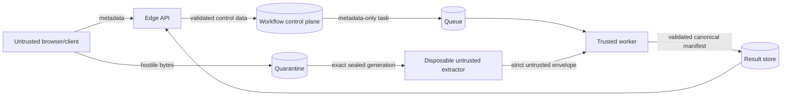

# Security and threat model

## 1. Security objective

The principal objective is to process attacker-controlled Windows executable content without
executing it and without allowing hostile bytes or untrusted parser output to compromise the
trusted decision plane, control plane, or public result contract.

This is a defense-in-depth design. No single file-format validation, process boundary, container,
model score, or policy decision is considered a complete security boundary.

## 2. Protected assets

- API, publisher, worker, database, queue, and storage service credentials;
- host kernel and worker filesystem;
- model and release artifacts;
- workflow/audit integrity;
- quarantine confidentiality and object immutability;
- public result integrity;
- tenant and user privacy;
- service availability and cost controls;
- analyst decisions based on the output.

## 3. Threat actors and inputs

Assume an unauthenticated or malicious submitter can control:

- the file bytes;
- filename and declared media type;
- declared size, digest, and request timing;
- malformed/duplicate HTTP headers and JSON fields;
- PE offsets, counts, names, imports, exports, resources, overlays, strings, and metadata;
- repeated, concurrent, interrupted, replayed, or conflicting requests.

Also assume infrastructure messages can be duplicated, reordered, delayed, malformed, or
redelivered, and that a disposable extractor may crash or become compromised while parsing.

## 4. Trust-boundary diagram

The extractor boundary is untrusted in both directions: the worker frames its input and strictly
validates its output. The edge API does not parse file content in the preferred async flow.

## 5. Threats and implemented controls

| Threat | Implemented controls | Residual risk |
|---|---|---|
| Oversized upload / memory exhaustion | Request-size guard, configured maximum, streaming local upload, bounded parser structures, concurrency limit | Distributed ingress/storage quotas and per-user limits are absent |
| Path traversal / filename attacks | Server-generated opaque keys; repository paths derived from validated identities; filename is presentation metadata | Filename can still be sensitive or unsafe if exported/logged by future code |
| Upload overwrite / TOCTOU | Create-only local object, private versioned Azure blob, exact generation, size and SHA-256 at seal and worker read | Storage configuration mistakes or privileged operator mutation remain possible |
| Parser exploit | Digest-pinned networkless, read-only, non-root container with resource limits, enforced seccomp, strict framed protocol | Container shares the host kernel; same-host process mode is fixtures-only and requires explicit acknowledgement |
| Queue used to exfiltrate content | Exact field allowlist, strict UTF-8 JSON, bounded message, no unknown/duplicate fields, DB payload constraints | Broker administrators and future schema changes require review |
| Duplicate/replayed delivery | Idempotency key, job nonce, leases, optimistic versions, fencing, at-least-once-aware worker, immutable result claim | Edge presentation context is not fully durable/reconstructible |
| Stale publisher/worker commit | Lease owner, expiry, fencing token, transactional checks | Clock/database operational failures still require monitoring |
| Model or release substitution | Canonical SHA-256 identities in task/envelope/result; digest-pinned container reference; model-derived ID | Artifact signing, transparency log, promotion policy, and remote attestation are absent |
| Malformed extractor output | Length-framed bounded JSON, exact fields, exact 2,381 finite values, bounded evidence/warnings | Valid but adversarial feature values may still exploit model weaknesses |
| Misleading high-confidence verdict | Calibrated score separated from evidence; high-risk requires corroboration; limitations included | Users can still over-trust labels; no workflow enforces human review |
| Result mutation | Canonical JSON SHA-256, content-addressed create-only object, immutable scan/release claim, read-time verification | Local storage is not independently signed or replicated by default |
| Cross-origin browser abuse | Explicit origin normalization, no wildcard, exact scan header, scoped short-lived upload capability | CORS does not protect against direct clients; authentication is absent |
| Credential exposure to extractor | Extractor image contains no cloud SDK/helper/model; minimal environment; no network | Host/runtime compromise can cross boundaries without stronger isolation |
| Denial of service | Bounded concurrency, sizes, parser counts, time/output limits, queue retry bound and DLQ | No authenticated quota, ingress rate limit, autoscaling policy, or cost guard is included |

## 6. Upload capability security

### Local

The API signs a short-lived HMAC capability bound to tenant, scan, object key, generation, and
expiry. A missing configured secret causes a random process secret to be generated, which is safe
for one local process but invalidates grants on restart and cannot support replicas.

### Azure

The API uses `DefaultAzureCredential` to create a user-delegation SAS for one Block Blob. The SAS
uses HTTPS and create/write permissions with a maximum 15-minute lifetime. Treat the complete SAS
URL as a secret. Ensure logs, reverse proxies, browser telemetry, and exception trackers redact
query strings.

## 7. Extraction security

The extractor receives a framed request containing bounded metadata followed by exact sample
bytes. It writes a bounded strict JSON frame to stdout. The trusted worker rejects trailing data,
duplicate fields, unknown fields, non-finite values, identity mismatches, and oversized output.

Container controls implemented in the command are valuable, but do not make parsing safe by
definition. The runner validates and attaches the repository seccomp profile before each launch.
Production should still prefer a disposable microVM, a dedicated hardened analysis host, or an
equivalent kernel-separation technology, with outbound network denied at the infrastructure layer.

## 8. Model and policy integrity

The public release provenance includes:

- analysis release SHA-256 identity;
- extractor image digest;
- worker image digest;
- feature schema ID and digest;
- model ID;
- calibrator ID;
- policy snapshot ID through the decision.

These identifiers make substitution visible only if deployment assigns them honestly and
consistently. A production release process should sign artifacts, verify signatures at startup,
record software bills of materials, and prevent mutable tags or in-place model replacement.

## 9. Result interpretation safety

The public manifest always declares `executed=false` and includes baseline limitations. Consumers
must preserve those fields.

- `likely_benign` means below the configured static threshold under one release, not safe.
- `needs_review` means ambiguity or a policy/quality reason requires human interpretation.
- `likely_malicious` means the model/policy crossed the malicious boundary; false positives are
  possible.
- `high_risk` adds corroborating high/critical evidence families, but remains a static assessment.
- `inconclusive` must never be converted to benign.

Do not automatically delete, block, disclose, or execute a file solely from this verdict without
an approved downstream policy and appeal/review process.

## 10. Privacy and sensitive data

Uploaded binaries, filenames, hashes, embedded URLs/strings, certificate metadata, and analyst
context can be confidential or personal data. The current platform minimizes propagation but
does not provide a complete data-governance layer.

Required operational controls include:

- region and residency selection;
- encryption and key management;
- least-privilege access and audit logs;
- retention, legal hold, and deletion policy;
- redaction in logs and support workflows;
- restrictions on downloading quarantined samples;
- incident notification and access review.

## 11. Known security gaps

### Critical before untrusted exposure

- No authentication or authorization.
- Tenant identity is a static configuration value, not an authenticated claim.
- No per-user/tenant quota or ingress rate limit.
- Local process extraction is not a sufficient hostile-code boundary.
- Containers still share the host kernel; a microVM or separate hardened host is required for a
  stronger production parser boundary.
- No automatic quarantine retention/deletion.

### Significant hardening gaps

- No artifact signing/verification or release transparency record.
- No centralized security telemetry, alerting, or incident runbook.
- No dependency/container scanning pipeline is committed.
- No behavioral sandbox, signature engine, reputation service, or certificate-chain validation.
- No stable readiness checks for model/database/queue/storage/extractor dependencies.
- No API security test suite for authorization because authorization does not yet exist.

## 12. Security review checklist

Before a release, verify:

- [ ] Threat model updated for all new fields and data flows.
- [ ] Authentication and tenant authorization enforced at every route and storage operation.
- [ ] Exact CORS origins and HTTPS configured.
- [ ] Upload limit, quota, and rate limit tested.
- [ ] Quarantine is private, versioned, encrypted, and exact-generation reads are enforced.
- [ ] Queue payload contains only the allowlisted metadata contract.
- [ ] Database migrations and immutable-content triggers are active.
- [ ] Extractor has no credentials/network, runs non-root/read-only, and has an enforced syscall
      and kernel-isolation policy.
- [ ] Model, images, schema, worker, calibrator, and policy identities are immutable and verified.
- [ ] Result digest and claim integrity are checked.
- [ ] Secrets and signed URLs are redacted from logs/traces.
- [ ] Retention and incident-response exercises have passed.
- [ ] A controlled malicious/malformed corpus is tested only in the approved isolated environment.

## 13. Relationship to existing notes

`docs/pe-upload-threat-model.md` records the earlier local synchronous upload design.
`docs/hostile-content-runtime.md` records the newer async trust-boundary design. This document
consolidates the current repository state and explicitly treats `static-pe-v1` as a compatibility
exception rather than the preferred architecture.
