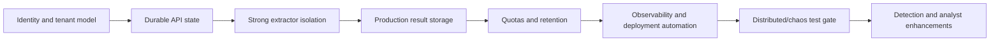

# Known limitations and roadmap

## 1. Current maturity assessment

The repository is a strong engineering MVP and security-oriented runtime prototype. It has
substantial domain validation, isolated extraction contracts, durable workflow/queue/storage
adapters, ML reproducibility, a usable dashboard, and broad backend tests.

It is not yet a production hostile-content service. The largest gap is not classifier code; it is
the surrounding identity, isolation, durability, operations, and governance layer.

## 2. Priority 0 — required before untrusted production traffic

### 2.1 Authentication, authorization, and tenant isolation

Implement an authenticated principal at ingress and derive tenant identity from verified claims,
not `MALWARE_HOSTILE_TENANT_ID`. Define roles for submission, result viewing, administration,
sample access, and retention. Apply tenant predicates to every workflow/result operation and test
cross-tenant denial.

Acceptance criteria:

- no anonymous scan or history access;
- tenant cannot be selected by request data;
- object grants are bound to authenticated tenant/principal;
- route, database, storage, and audit tests cover isolation;
- CORS remains a browser control, not the authorization mechanism.

### 2.2 Strong extraction isolation

The current container runner enforces the reviewed seccomp profile. The remaining target is an
ephemeral microVM or separate analysis host with no credentials, no network, read-only image,
bounded resources, and verified image identity.

Acceptance criteria:

- isolation policy is applied and testable at runtime;
- extractor cannot reach cloud metadata, control plane, result store, model, or network;
- timeout/output/resource exhaustion tests pass;
- host compromise blast radius is documented and accepted.

### 2.3 Durable, reconstructible API state

Persist or deterministically reconstruct filename/presentation, upload grant context, and public
result response data. API replicas and restarts must serve the same status from PostgreSQL and
immutable storage without an in-memory cache dependency.

Acceptance criteria:

- create on replica A and retrieve/seal on replica B;
- restart at every workflow state without losing status/history;
- expired grants and sealed generations remain unambiguous;
- stable cursor pagination replaces merged process-local recent history.

### 2.4 Production result storage composition

Add explicit result-backend settings and wire the implemented Azure immutable repository, or
choose another durable WORM-capable store. Keep exact create-only object and claim semantics.

Acceptance criteria:

- result backend selected by validated configuration;
- write/read/conflict/corruption tests run against the real service;
- backup, replication, and retention policy defined;
- workflow never completes until the referenced immutable object is verifiable.

### 2.5 Quotas, rate limits, and abuse controls

Add authenticated upload/scan quotas, request rate limits, storage budgets, concurrent work
budgets, and cost alarms at ingress and service layers.

Acceptance criteria:

- limits are per tenant/principal as well as global;
- rejection is observable and safe;
- no bypass through create-without-upload, abandoned uploads, or repeated idempotency keys;
- incomplete scans expire and storage is reconciled.

### 2.6 Retention, expiry, and secure disposal

Implement lifecycle jobs for abandoned upload grants, incomplete workflows, quarantine objects,
results, dead letters, logs, datasets, and artifacts. Support legal hold and audit evidence.

Acceptance criteria:

- policy is explicit per data class;
- exact-identity deletion is idempotent and audited;
- orphan detection/reconciliation exists;
- backups follow the same eventual deletion policy.

## 3. Priority 1 — production reliability and security operations

### 3.1 Readiness, metrics, tracing, and alerting

Add dependency-aware readiness separate from liveness. Instrument state age, outbox lag, queue
depth, dead letters, extractor outcomes, model/release IDs, result integrity, storage growth, and
API latency. Redact hostile/sensitive values by construction.

### 3.2 Deployment automation

Create repeatable infrastructure and service deployment definitions for PostgreSQL, RabbitMQ,
storage, API, publisher, worker, extractor boundary, frontend, secrets, network policies, and
monitoring. Add staged rollouts and rollback.

### 3.3 Artifact supply-chain controls

Build, scan, sign, and attest backend/worker/extractor images and model artifacts. Generate an
SBOM, verify signatures on deployment/startup, and prohibit mutable tags behind a release ID.

### 3.4 Distributed integration and chaos tests

Run real PostgreSQL/RabbitMQ/Azure tests in CI or a controlled environment. Exercise duplicate
delivery, broker/database restart, worker crash, stale leases, poison messages, storage
conflicts, API failover, and result corruption.

### 3.5 Frontend automated tests and accessibility

Add unit/component/browser tests for navigation, scan lifecycle, upload failure, terminal states,
history, responsive layout, and protocol-downgrade error handling. Add keyboard, screen-reader, contrast,
and reduced-motion acceptance tests.

### 3.6 API lifecycle operations

Add explicit cancel and, where policy permits, resubmit/delete operations. Every operation must
respect terminal immutability, exact content identity, tenant authorization, and audit events.

## 4. Priority 2 — detection quality and analyst experience

### 4.1 Model explainability

Compose a bounded trusted explainer and expose model contributors separately from observed
evidence. Validate contribution schema, calculation cost, stability, and analyst wording. Never
present model attribution as a fact observed in the file.

### 4.2 Signature and reputation layer

Add optional defense-in-depth integrations for cryptographic reputation, trusted signer chain,
AV/signature engines, or YARA under separate, documented trust and update models. Preserve source,
timestamp, database version, and failure/unknown states.

### 4.3 Behavioral sandbox integration

For samples requiring more confidence, submit the exact sealed digest to a separate behavioral
sandbox. Keep detonation completely outside the static worker and make its stronger containment,
network simulation, data handling, and result correlation explicit.

### 4.4 Drift and model governance

Track score distributions, label feedback, calibration drift, false-positive/negative review,
dataset lineage, approval, rollback, and scheduled evaluation. Retraining must remain a reviewed
release process rather than an automatic replacement.

### 4.5 Analyst workflow

Add stable search/filter/pagination, result export with integrity proof, notes/triage state,
role-based sample access, case-system integration, and explicit feedback labels.

## 5. Priority 3 — maintainability and product cohesion

- Choose one canonical product/package name and update distribution metadata deliberately.
- Version the HTTP protocol and public manifest with a compatibility policy.
- Split the large dashboard page into feature modules and add a typed generated API client.
- Establish a generated-component lint policy for `frontend/components/ui/`.
- Add architecture decision records for storage, queue, isolation, release identity, and tenant
  boundaries.
- Generate a changelog and release notes from reviewed changes.
- Add documentation ownership and review automation.

## 6. Suggested delivery order

The fastest safe sequence is:

Identity should come first because it changes storage keys, query predicates, audit events,
quotas, and frontend behavior. Detection enhancements should not delay controls required to
safely expose the existing scanner.

## 7. Definition of production-ready

The platform should not be labelled production-ready until all of the following are evidenced:

- authenticated, authorized, tested tenant isolation;
- approved hostile-parser isolation with no credentials/network;
- durable restart-safe workflow and result retrieval across replicas;
- immutable signed release artifacts and verified identities;
- managed PostgreSQL, RabbitMQ, quarantine, and result stores with backups;
- quotas, rate limiting, incomplete-work expiry, retention, and secure disposal;
- dependency-aware readiness, metrics, alerts, traces, and incident runbooks;
- real-service integration, failure-injection, security, frontend, and accessibility tests;
- documented privacy, residency, legal-hold, and access-review procedures;
- controlled canary, rollback, and disaster-recovery exercises;
- explicit security and model-risk approval.

## 8. Deliberately deferred capabilities

RabbitMQ and Azure are no longer conceptual future items—the adapters exist—but complete managed
deployment remains deferred. Behavioral analysis, live reputation, family classification,
automatic retraining, and broad analyst case management remain separate future capabilities and
should not be implied by the current UI.
